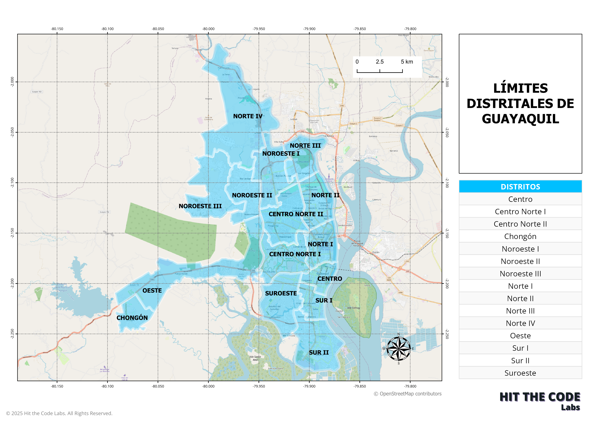

# QGIS Workflow Automation




This script provides a series of functions to automate common tasks in QGIS, including loading layers, calculating areas and centroids, and creating print layouts. It is designed to streamline workflows involving geospatial data and simplify tasks like map creation and data analysis.

## Features

- **Layer Management**:
  - Load raster layers (e.g., Bing Aerial imagery).
  - Load vector layers from KML/KMZ, GeoJSON and shp/shx files.
  - Remove existing layers to avoid duplication.

- **Data Processing**:
  - Calculate the area (in hectares) of polygons.
  - Determine centroids of polygon features.

- **Visualization**:
  - Add styled polygon and marker layers to the QGIS project.
  - Create and customize a simple print layout with maps and labels.

## Requirements

- **Software**:
  - QGIS (3.x recommended)
  - Python 3.x

- **Python Libraries**:
  - `qgis.core`
  - `PyQt5`

## Usage

### 1. Import the Script
Ensure QGIS Python APIs are properly configured in your Python environment. Import this script into your project.

### 2. Functions Overview

#### Layer Management
- `remove_existing_layer(project, layer_name)`
  Removes a layer from the QGIS project by name.

- `read_kmz_with_qgis(file_path)`
  Loads vector layers from KMZ or KML files.

- `load_raster_layer(project, layer_name, url)`
  Adds raster layers (e.g., Bing or Google Satellite) to the project.

#### Data Processing
- `calculate_area_and_centroid(polygon_layer, project)`
  Calculates the total area and centroid of a polygon layer in the given CRS.

#### Visualization
- `create_marker_layer(project, centroid_point)`
  Creates a marker layer at a given point.

- `create_simple_layout(project, polygon_layer, raster_layer)`
  Generates a basic print layout with a map and a label.

### 3. Run the Main Workflow
The `main_demo` function demonstrates the script's capabilities:

```python
main_demo("path/to/your_polygon.kml")
```
Steps included:
1. Load a raster layer (e.g., Bing Aerial).
2. Load a polygon layer from a KML/KMZ file.
3. Calculate the area and centroid of the polygon.
4. Create a marker at the centroid.
5. Generate a print layout with the polygon and raster layers.

## Example Output
- **Area and Centroid**: Computes polygon area in hectares and the centroid in UTM coordinates.
- **Print Layout**: Creates a layout with a title and a map showcasing the polygon and raster layers.

## Customization
Modify symbol colors, font sizes, map extents, or CRS settings to suit your needs.

## Notes
- Ensure proper file paths for KML/KMZ inputs.
- Adapt CRS transformations as required for your data.

## License
This script is open-source and available for customization. Feel free to adapt it for your geospatial workflows.
